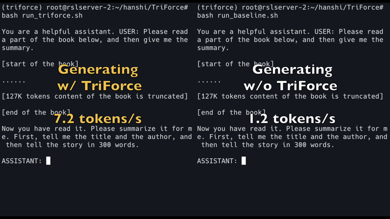
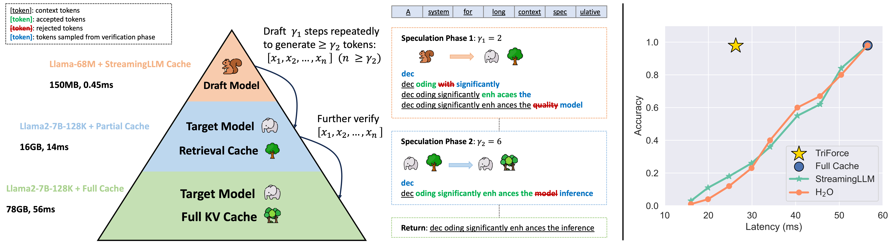

<div align="center">
<h1> TriForce: Lossless Acceleration of Long Sequence <br> Generation with Hierarchical Speculative Decoding
</h1>


**trainig-free, accelerate long sequence generation**
</div>
<div align="center">
<b>Hanshi Sun</b><sup>1</sup>,
<b>Zhuoming Chen</b><sup>1</sup>,
<b>Xinyu Yang</b><sup>1</sup>,
<b>Yuandong Tian</b><sup>2</sup>,
<b>Beidi Chen</b><sup>1,2</sup>
</div>

<div align="center">
<sup>1</sup>Carnegie Mellon University
<sup>2</sup>Meta AI (FAIR)
</div>

<div align="center">
[<a href="https://arxiv.org/abs/2404.11912">Paper</a>] | [<a href="https://infini-ai-lab.github.io/TriForce">Blog</a>]
</div>
<br>
<div align="center">

<figcaption>serving <a href="https://huggingface.co/LargeWorldModel/LWM-Text-Chat-128K">LWM-Text-Chat-128K</a> with offloading on 2x RTX 4090s (prefill 127K contexts)</figcaption>
</div>
<br>

<div align="center">

<figcaption>TriForce Framework</figcaption>
</div>

## Environment Set Up
```bash
conda create -n TriForce python=3.9
conda activate TriForce

pip install -r requirements.txt
pip install flash-attn --no-build-isolation # install flash-attn
```

## Evaluations
Currently, only long-context Llama models are supported (including [Llama2-7B-128K](https://huggingface.co/NousResearch/Yarn-Llama-2-7b-128k), [Llama2-13B-128K](https://huggingface.co/NousResearch/Yarn-Llama-2-13b-128k), [LWM-Text-128K](https://huggingface.co/LargeWorldModel/LWM-Text-128K), [LWM-Text-Chat-128K](https://huggingface.co/LargeWorldModel/LWM-Text-Chat-128K)).

### On-Chip
On-chip results can be reproduced on A100 by running the following command. `--prefill` specifies the context length of prompt and `--budget` specifies the budget of retrieval cache. `chunk_size` specifies the chunk size of the KV cache. `top_p` and `temp` are the sampling hyperparameters, which are set to 0.9 and 0.6 by default. `gamma` is the number of speculative decoding steps. You should observe a 2.2x speedup by running the following command on a single A100. `gs` contains 20 samples from PG-19, `128k` contains 128K samples, and `lwm` contains samples from NarrativeQA

```bash
# TriForce, on A100
CUDA_VISIBLE_DEVICES=0 python test/on_chip.py --prefill 124928 --budget 4096 \
 --chunk_size 8 --top_p 0.9 --temp 0.6 --gamma 6
```
### Offloading
#### Offloading with Tensor Parallelism
Our framework supports tensor parallelism for offloading setting. The `--nproc_per_node` should be set to the number of GPUs used for offloading. The following command demonstrates how to use tensor parallelism with 2 GPUs. It should be noted that RTX 4090s do not support CUDA Graph for tensor parallelism (while A100 supports). Therefore, we disabled CUDA Graph for this setting. `--on_chip` specifies the number of layers' KV cache that are on-chip, which can adjusted based on hardware. The performance of offloading significantly relies on bandwidth of PCIE. In order to get accurate results, it is best to ensure that the bandwidth is not used by other programs.

```bash
# TriForce
CUDA_VISIBLE_DEVICES=0,1 OMP_NUM_THREADS=48 torchrun --nproc_per_node=2 \
test/offloading_TP.py --budget 12288 --prefill 130048 --dataset gs \
--target llama-7B-128K --on_chip 9 --gamma 16
```

#### Offloading without Tensor Parallelism
We recommend to use 2x RTX 4090s for offloading setting since the encoding time is much shorter and the generation latency is lower. But if you only have 1x RTX 4090, you can still run the following command. Since the budget is smaller, the avergae accepted token length is shorter.

```bash
# TriForce, CUDA Graph
# Huggingface backend, and cuda graph may take some extra HBM
CUDA_VISIBLE_DEVICES=0 python test/offloading.py --prefill 130048 \
--chunk_size 8 --temp 0.6 --top_p 0.9 --gamma 12 --dataset gs \
--budget 8192 --target llama-7B-128K

# TriForce, overlapping computation and loading
# overlapping may take some extra HBM
CUDA_VISIBLE_DEVICES=0,1 OMP_NUM_THREADS=48 torchrun --nproc_per_node=1 \
test/offloading_TP.py --budget 8192 --prefill 130048 --dataset gs \
--target llama-7B-128K --on_chip 0 --gamma 12
```


#### Baseline
For offloading, we provide an implementation of the auto-regressive baseline for comparison purposes. If the performance of TriForce does not meet expectations, which may be due to low PCIE bandwidth, we advise evaluating the baseline's performance on identical hardware. To demonstrate how to execute the baseline with different hardware configurations, here are the commands for running it on two RTX 4090 GPUs and separately on a single RTX 4090 GPU.

```bash
# 2x RTX 4090s
CUDA_VISIBLE_DEVICES=0,1 OMP_NUM_THREADS=48 torchrun --nproc_per_node=2 \
test/offloading_TP.py --budget 0 --prefill 130048 --dataset demo \
--target lwm-128K --on_chip 12 --baseline

# 1x RTX 4090
CUDA_VISIBLE_DEVICES=0,1 OMP_NUM_THREADS=48 torchrun --nproc_per_node=1 \
test/offloading_TP.py --budget 0 --prefill 130048 --dataset demo \
--target lwm-128K --on_chip 2 --baseline
```

## Citation
If you find TriForce useful or relevant to your project and research, please kindly cite our paper:

```bibtex
@article{sun2024triforce,
  title={TriForce: Lossless Acceleration of Long Sequence Generation with Hierarchical Speculative Decoding},
  author={Sun, Hanshi and Chen, Zhuoming and Yang, Xinyu and Tian, Yuandong and Chen, Beidi},
  journal={arXiv preprint arXiv:2404.11912},
  year={2024}
}
```
